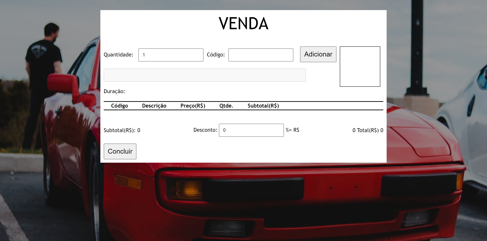

* Centro Federal de Educação Tecnológica Celso Suckow da Fonseca (CEFET/RJ) UNIED Nova Friburgo
* Aluno(a): Sérgio de Souza Lima Sobrinho 
* Matrícula: 1911837GSIS
* Professor(a): Thiago Delgado Pinto
* Curso: Bacharelado em Sistemas de Informações
* Período: 2º Semestre - 2020.2

* Disciplina: Programação de Cliente Web

## P1 - Primeira Avaliação

 